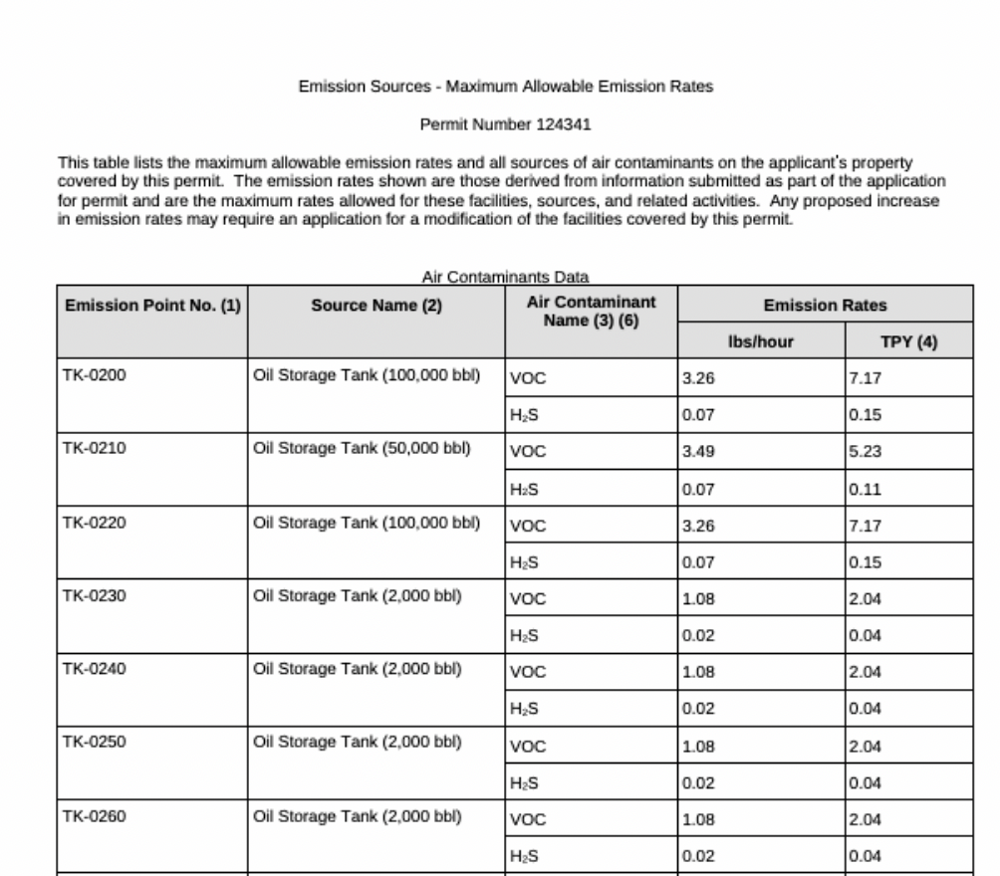
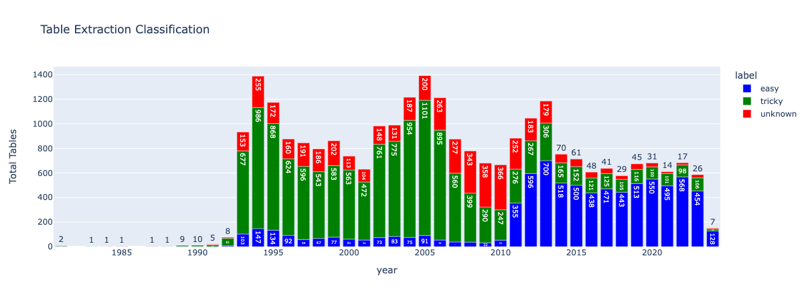

# Project Outline

# Freshness

Latest Data Extraction: April 5, 2024

# The Numbers

- 121775 scraped regulated entities.
- 24828 MAERT pdfs downloaded from 6102 unique regulated entities
- 22120 table sucessfully extracted
- after removing duplicates 20680 unique registered entities <> permit number <> publish date combiniations

# The Data

Definitions sourced from [TCEQ's Guidance Page](https://www.tceq.texas.gov/permitting/central_registry/guidance.html)

## `data/combined_entities.csv`

A list of regulated entities scraped from Process Step 1.

| column name             | description                                                                                                                                                                                                                                                      |
| ----------------------- | ---------------------------------------------------------------------------------------------------------------------------------------------------------------------------------------------------------------------------------------------------------------- |
| `rn_number`             | Each site location is issued a unique 11-digit identification number called an RN (e.g., RN123456789).                                                                                                                                                           |
| `regulated_entity_name` | Regulated Entity – A “Regulated Entity” is a person, organization, place, or thing that is of environmental interest to TCEQ where regulatory activities of interest to the Agency occur or have occurred in the past. Examples are a site, facility or license. |
| `county`                | The county where the Regulated Entity is located. If there is more than one county, provide the primary county in which the majority of the Regulated Entity is located.                                                                                         |
| `location`              | Address of the Regulated Entity or if the physical location has no street address, then specific directions to reach theRegulated Entity                                                                                                                         |

## `data/MAERT_lookup.csv`

Lookup table of all scraped MAERTs. A Regulated Entity can have more than one MAERT. A permit number can have more than one MAERT.

| column name              | description                                                                                            |
| ------------------------ | ------------------------------------------------------------------------------------------------------ |
| `rn_number`              | Each site location is issued a unique 11-digit identification number called an RN (e.g., RN123456789). |
| `permit_number`          | Permit Number of MAERT                                                                                 |
| `publish_date`           | Publish Date as listed on the Document Portal M-D-YYYY                                                 |
| `relative_file_location` | location of named MAERT PDF relative to repo                                                           |

## `data/final.csv.zip`

Zipped due to Github Large File Storage Limitations
| column name | description |
|-------------------------|-----------------------------------------------------------------------------------------------------------------------------------------------------------------------------------------------------------------------------------------------------------------------------------------------------------------------------------------------------------------------------------------------------------------------------------------------------------------------------------------------------------------------------------------------------------------------------------------------------------------------------------------------------------------------|
| Emission Source | Either specific equipment designation or emission point number (EPN) from plot plan. |
| Source Name | Specific point source name |
| Air Contaminant Name | An example of possible values. Specific values can be found in the corresponding MAERT. <ul> <li> CO - carbon monoxide </li> <li> NOx - total oxides of nitrogen </li> <li> PM10 - particulate matter equal to or less than 10 microns in diameter. Where particulate matter is not listed, it shall be assumed that no particulate matter greater than 10 microns in emitted. </li> <li> SO2 - sulfur dioxide </li> <li> VOC - volatile organic compounds as defined in Title 30 Texas Administrative Code § 101. </li> <li> CO - carbon monoxide </li> <li> CO - carbon monoxide </li> </ul> |
| Emission Rate lbs/hr | The allowable emission rates listed for individual source in lbs/hr |
| Emission Rate tons/year | The allowable emission rates listed for individual source in tons/year |
| rn_number | Each site location is issued a unique 11-digit identification number called an RN (e.g., RN123456789). |
| permit_number | Permit Number of MAERT |
| publish_date | Publish Date as listed on the Document Portal M-D-YYYY |
| file_location | location of named MAERT PDF relative to repo |

# The Process

## 1. Getting/scraping the full list of registered facilities, their metadata, and their permit numbers

Compile a list of registered facilities by searching with zipcode + county. \
zipcode: `data_liberation_project/texas_air/scripts/metadata_regulated_entities zipcode.py`\
county: `data_liberation_project/texas_air/scripts/metadata_regulated_entities.py`

## 2. For each permit number, scraping the TCEQ's document portal to fetch the particular kind of PDF that includes the allowable-emissions limits

Using data gathered from Step 1. Use `data_liberation_project/texas_air/python/collect_pdfs_for_regulated_entities.py` to scrape document portal via RN search.

The PDFs are stored under data/MAERT.

With a file naming convention of (`registeredEntitiesNumber`)\_(`PermitNumber`)\_(`dateModified`)\_(`scrapeDate`).pdf
EX:`RN111577540_170526_12-8-2023_1712015282.pdf`

## 3. Extracting that table of emissions limits from the PDFs into structured data/Standardizing that data

`COLUMNS = ["Emission Source","Source Name", "Air Contaminant Name", "Emission Rate lbs/hr", "Emission Rate tons/year"]`

MAERT are extracted via the following schema.

The [PDF Plumber iPython Notebook](texas_air/table_extraction/pdf_plumber.ipynb) is used to extract tables from the pdfs.

Using two strategies

- extract_table()
- custom formatter at [tricky_tables.py](texas_air/table_extraction/tricky_tables.py)

The final file lives at `data/final.csv`

## Sample Table

# Document Statistics

Extraction strategies were successful in documents spanning over all years.

Starting in 1992, friendly formatted PDFs appeared (under category easy). It seems that wide adoption of friendly formatted PDFs unfortunately didn't persist.

Easy Tables + Tricky Tables were extracted.
Unknown Tables were not possible to extract.

